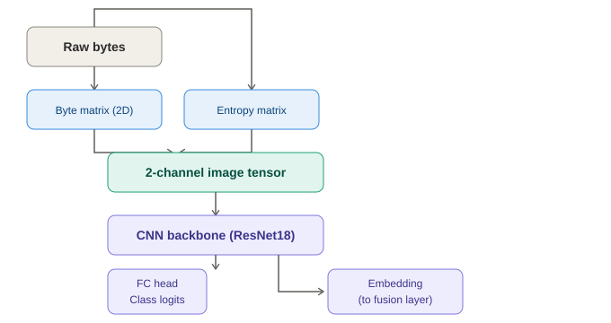
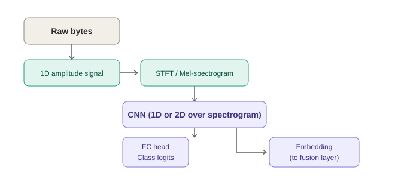
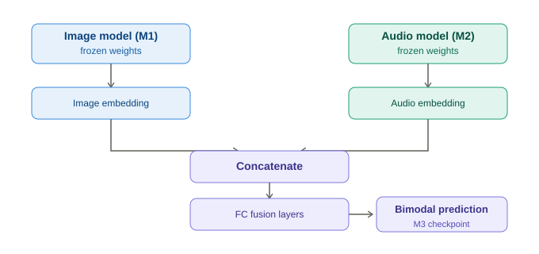
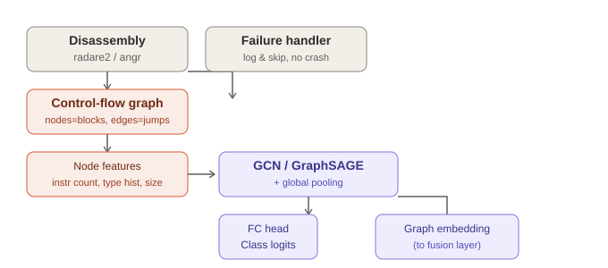
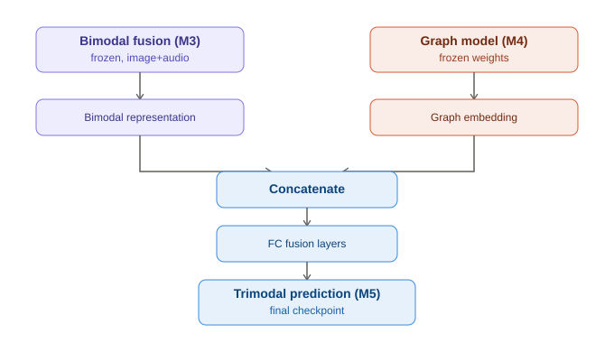

> **DUPLICATE.** This file is an earlier copy that differs from
> [`System_Architecture_Multimodal_Malware.md`](./System_Architecture_Multimodal_Malware.md)
> only by its embedded diagram links. Those diagrams now live in
> [`diagrams/`](./diagrams/) and are embedded in the canonical file. Safe to delete.

# System Architecture Document
## Multimodal Malware Family Classification System

**v1.0 | Ref: PRD v1.0, SRS v1.0**

---

## 1. Architectural Style
Modular, branch-and-fuse pipeline. Each modality (image, audio, graph) is an **independent, swappable module** with its own preprocessing, model, checkpoint, and test harness. Branches only interact at the **fusion layer** (embedding concatenation), never earlier — this lets any branch be built, tested, or dropped in isolation (NFR-Maintainability).

Five layers, top to bottom:

1. **Data layer** — raw datasets, sample registry, train/val/test splits
2. **Preprocessing layer** — per-branch transforms (byte→image, byte→spectrogram, binary→CFG)
3. **Model layer** — per-branch CNN/GNN + fusion classifier
4. **Evaluation layer** — metrics, cross-dataset test, robustness test
5. **Explainability layer** — Grad-CAM, GNNExplainer, PE-section mapping

---

## 2. Layer 1 — Data Layer

| Component | Responsibility |
|---|---|
| `dataset_registry` | Maps each dataset (Malimg, BIG2015, BODMAS) to a common schema: `{sample_id, binary_path, family_label, source_dataset}` |
| `split_manager` | Produces fixed, seeded train/val/test splits per dataset; persists split indices to disk for reproducibility (NFR-Reproducibility) |
| `sample_cache` | Avoids reprocessing: caches generated images/spectrograms/graphs to disk keyed by `sample_id` |

**Interfaces out:** raw binary bytes + label, per `sample_id`, to all three preprocessing modules.

---

## 3. Layer 2 — Preprocessing (per branch)

### 3.1 Image Preprocessing (`image_prep`)
1. Read raw bytes.
2. Reshape into 2D matrix (fixed resize, or Nataraj width convention by file size).
3. Compute sliding-window Shannon entropy over the same byte stream → second matrix, same shape.
4. Stack `[byte_channel, entropy_channel]` (+ optional 3rd channel, e.g. duplicate or gradient) → image tensor.
5. Output: fixed-size image tensor, cached to disk.

**Failure mode:** none expected — every binary has bytes. No skip logic needed here.

### 3.2 Audio Preprocessing (`audio_prep`)
1. Read raw bytes, normalize to amplitude range (e.g. [-1, 1] or [0, 255]→[-1,1]).
2. Treat as 1D signal at an arbitrary fixed sample rate.
3. Compute STFT or Mel-spectrogram via `librosa`.
4. Output: fixed-size spectrogram tensor, cached to disk.

**Failure mode:** none expected (same reasoning as image branch — any byte stream is a valid signal).

### 3.3 Graph Preprocessing (`graph_prep`)
1. Disassemble binary via `radare2`/`r2pipe` or `angr`.
2. Build CFG: nodes = basic blocks (or functions for coarser/faster call-graph), edges = jumps/calls.
3. Attach node features: instruction count, instruction-type histogram, block size.
4. Convert to `torch_geometric.data.Data` object, cache to disk.

**Failure mode:** disassembly can fail on packed/obfuscated binaries.
- **On failure:** log `sample_id` + reason to `failures.log`; exclude sample from graph-branch training/eval only (it remains usable for image/audio branches and for whole-pipeline evaluation once fusion handles missing modalities — see §6.4).
- **Must never crash the pipeline** (NFR-Reliability, FR3).

---

## 4. Layer 3 — Model Layer

Each stage below is built, checkpointed, and tested **independently**, in the order M1 → M2 → M3 → M4 → M5. Later stages freeze and reuse earlier checkpoints rather than retraining them.

### 4.1 M1 — Image Model (standalone)

```
Raw bytes → byte matrix (2D reshape)         ─┐
         → sliding-window Shannon entropy    ─┴→ stack → 2-channel image tensor
                                                            → CNN backbone (ResNet18)
                                                            → FC head → class logits (test)
                                                            → penultimate layer → image embedding (held for fusion)
```
**Test:** standalone accuracy/F1, cross-dataset eval, Grad-CAM. **Checkpoint:** `m1-image`.



### 4.2 M2 — Audio Model (standalone)

```
Raw bytes → normalize to 1D amplitude signal → STFT / Mel-spectrogram (librosa)
                                              → CNN (1D or 2D)
                                              → FC head → class logits (test)
                                              → penultimate layer → audio embedding (held for fusion)
```
**Test:** standalone accuracy/F1. **Checkpoint:** `m2-audio`.



### 4.3 M3 — Image + Audio Fusion (bimodal)

```
M1 (frozen) → image embedding ─┐
                                ├→ concatenate → FC fusion layers → softmax → bimodal prediction
M2 (frozen) → audio embedding ─┘
```
- M1 and M2 weights are **frozen**; only the concat + FC fusion layers are trained.
- **Test:** accuracy/F1 vs. M1 alone and M2 alone — confirms fusion adds value.
- **Checkpoint:** `m3-bimodal`.



### 4.4 M4 — Graph Model (standalone)

```
Binary → disassembly (radare2/r2pipe or angr) → control-flow graph
                                                  (nodes = basic blocks, edges = jumps/calls)
                                                → attach node features (instr count, type histogram, block size)
                                                → torch_geometric Data object
                                                → GCN / GraphSAGE + global pooling
                                                → FC head → class logits (test)
                                                → graph-level embedding (held for fusion)
```
- Disassembly failures are logged and skipped — never crash the pipeline (FR3, NFR-Reliability).
- **Test:** standalone accuracy/F1, disassembly failure rate. **Checkpoint:** `m4-graph`.



### 4.5 M5 — Full Trimodal Fusion

```
M3 (frozen) → bimodal representation ─┐
                                       ├→ concatenate → FC fusion layers → softmax → trimodal prediction
M4 (frozen) → graph embedding ────────┘
```
- M3's fused representation and M4's graph embedding are concatenated at a **second** fusion stage (not a flat 3-way concat) — this mirrors the build order (bimodal first, then add structure) and lets the graph branch's contribution be measured in isolation.
- **Staged training within M5:**
  1. Freeze M3 and M4; train the new FC fusion layers only.
  2. (Optional) Unfreeze and fine-tune end-to-end at low learning rate.
- **Test:** accuracy/F1 vs. M3 alone and M4 alone; this is also the checkpoint used for the robustness comparison (FR7, M1 vs. M5).
- **Checkpoint:** `m5-trimodal`.



### 4.6 Summary Table

| Stage | Inputs | Frozen components | New trainable component | Compared against |
|---|---|---|---|---|
| M1 | Image branch only | — | Image CNN | Baseline for robustness test |
| M2 | Audio branch only | — | Audio CNN | — |
| M3 | M1 + M2 embeddings | M1, M2 | FC fusion (bimodal) | M1, M2 |
| M4 | Graph branch only | — | GNN | — |
| M5 | M3 + M4 | M3, M4 | FC fusion (trimodal) | M3, M4; also vs. M1 under robustness test |

### 4.7 Model Registry / Checkpointing
- `checkpoints/{branch}_{stage}.pt` naming convention.
- Each checkpoint stores: model weights, optimizer state, epoch, validation metric, git tag reference (`m1-image`, `m2-audio`, `m3-bimodal`, `m4-graph`, `m5-trimodal` — per PRD §8).
- Enables resuming training across Colab/Kaggle sessions (NFR-Performance).

### 4.3 Model Registry / Checkpointing
- `checkpoints/{branch}_{stage}.pt` naming convention.
- Each checkpoint stores: model weights, optimizer state, epoch, validation metric, git tag reference (`m1-image`, `m2-audio`, etc. — per PRD §8).
- Enables resuming training across Colab/Kaggle sessions (NFR-Performance).

---

## 5. Layer 4 — Evaluation Layer

| Module | Function |
|---|---|
| `metrics_engine` | Computes per-family precision/recall/F1, macro/micro averages, confusion matrix (scikit-learn) |
| `cross_dataset_evaluator` | Loads best fused checkpoint, runs inference on a second dataset's preprocessed samples (no gradient updates); reports accuracy/F1 delta vs. in-distribution result; optionally triggers few-shot fine-tune sub-routine |
| `robustness_evaluator` | Applies junk-byte padding / minor repacking perturbation to a held-out subset; re-runs both the image-only baseline (M1) and the final trimodal model (M5) through their full preprocessing + inference paths; reports accuracy/F1 degradation for each |
| `report_writer` | Aggregates all of the above into CSV / Weights & Biases logs and Matplotlib figures |

**Data flow for robustness testing:** perturbation happens on the **raw binary**, before preprocessing — so the perturbed sample flows through the *same* image/audio/graph preprocessing pipelines as any other sample, ensuring a fair comparison.

---

## 6. Layer 5 — Explainability Layer

| Module | Function |
|---|---|
| `gradcam_engine` | Runs Grad-CAM (`pytorch-grad-cam`) on the image branch's final conv layers → heatmap per sample |
| `pe_section_mapper` | Uses `pefile` to extract PE section boundaries; maps heatmap regions back to file offsets and overlays section labels (e.g. `.text`, `.data`, import table) |
| `gnn_explainer` (optional/stretch) | Runs `torch_geometric`'s `GNNExplainer` on the graph branch to highlight influential nodes/subgraphs |
| `explanation_renderer` | Produces final overlay images (Matplotlib) for mentor/evaluator review — must be readable by a non-ML-specialist (NFR-Usability) |

### 6.4 Handling Missing Modalities at Inference
If a sample's graph branch failed during preprocessing (disassembly failure), the fusion classifier at inference time falls back to the **bimodal (image+audio) fusion path (M3)** for that sample rather than failing. This is logged as a documented limitation, consistent with SRS §8.

---

## 7. Component Interaction Summary

```
Data layer
   → Preprocessing layer (3 parallel, independent pipelines)
      → Model layer (3 branch models → fusion classifier)
         → Evaluation layer (metrics, cross-dataset, robustness)
         → Explainability layer (Grad-CAM, PE mapping, GNNExplainer)
            → Report writer (CSV / plots / W&B)
```

- **Coupling:** branches are decoupled until the fusion concat step; evaluation and explainability layers only depend on trained checkpoints + cached preprocessed data, never on re-running earlier layers.
- **Reproducibility hook:** every layer reads/writes through the same `sample_cache` and `checkpoints/` conventions, so any stage can be re-run independently given the same seed.

---

## 8. Technology-to-Component Map

| Component | Technology |
|---|---|
| Image preprocessing / model | NumPy, PIL/OpenCV, PyTorch, torchvision |
| Audio preprocessing / model | `librosa`, NumPy, PyTorch |
| Graph preprocessing / model | `radare2` + `r2pipe` (or `angr`), PyTorch Geometric |
| Fusion classifier | PyTorch |
| Metrics / reporting | scikit-learn, pandas, Matplotlib |
| Explainability | `pytorch-grad-cam`, `pefile`, `torch_geometric.GNNExplainer` |
| Experiment tracking | Weights & Biases or CSV logging |
| Compute environment | Google Colab / Kaggle (GPU tier) |

---

## 9. Deployment / Execution Model
- **Batch, offline only** — no live inference server, no API endpoint (explicit non-goal in PRD).
- Runs as a sequence of notebooks/scripts per checkpoint (M1–M5 + robustness), executed manually in Colab/Kaggle, with intermediate artifacts (cached preprocessed data, checkpoints, metrics) persisted to Drive/local disk between sessions.
- No network dependency at inference time once models are trained (SRS §4.3).
